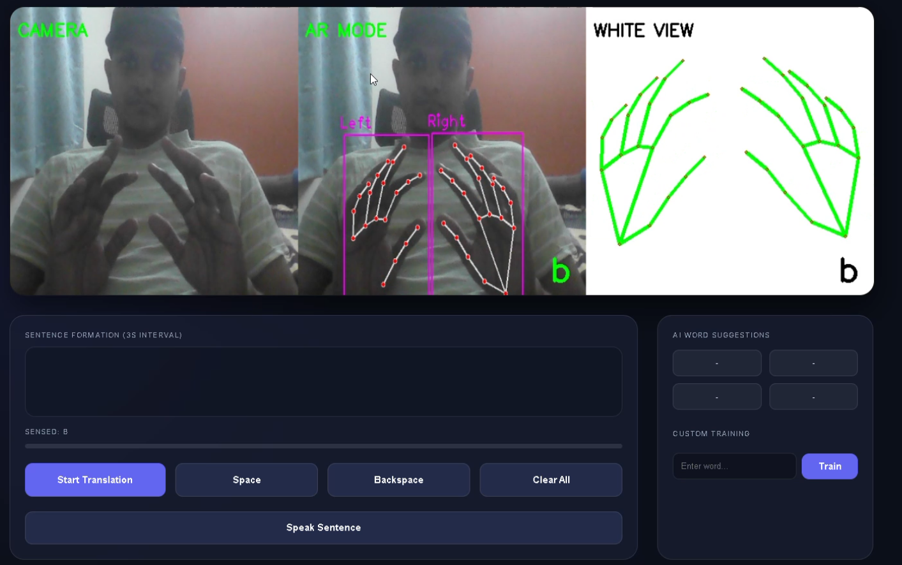
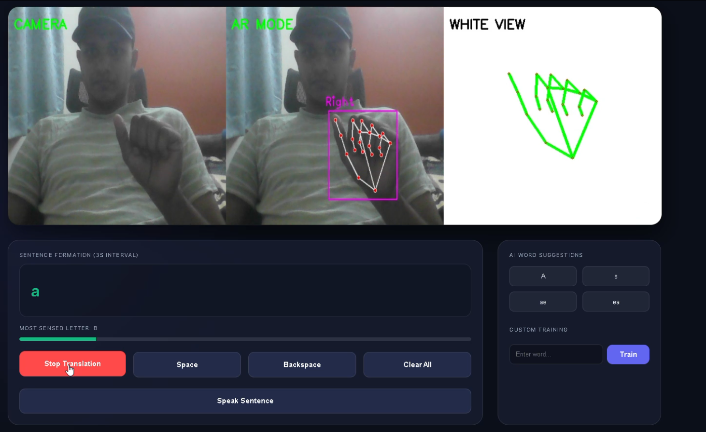
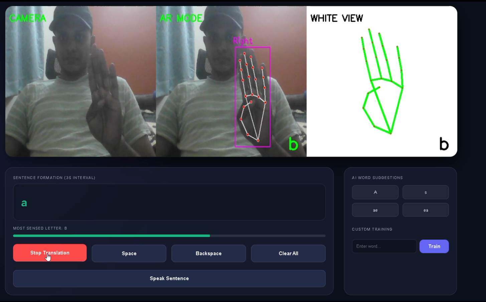
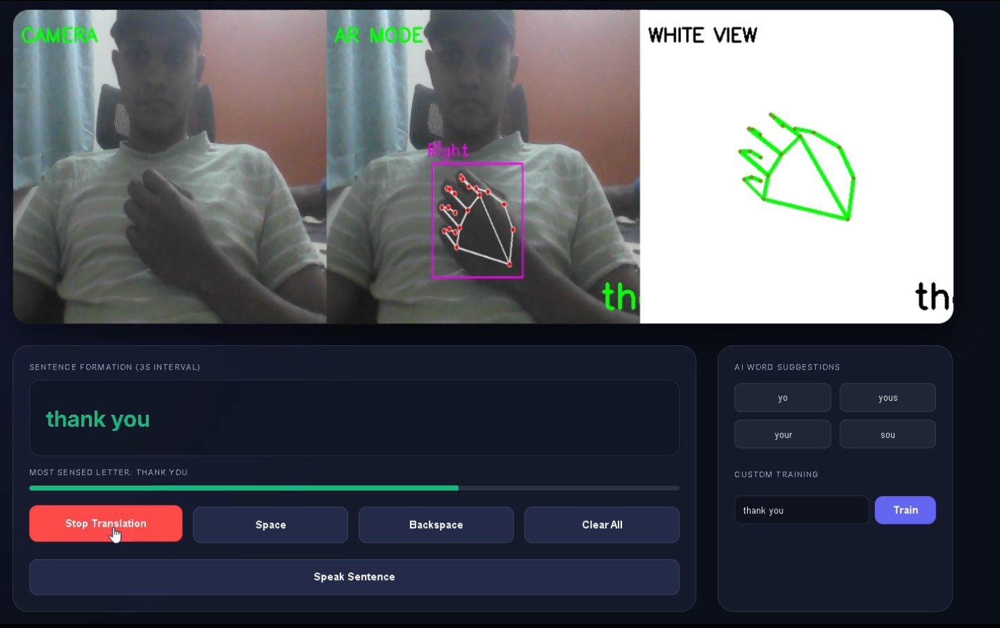
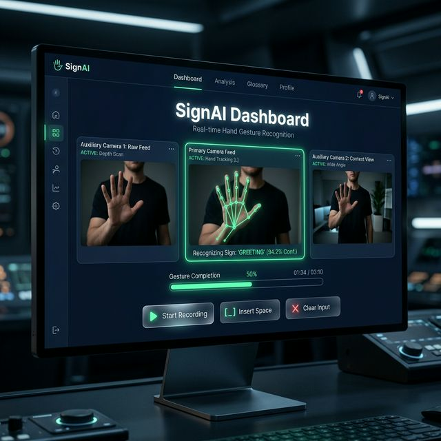

# 🤟 SignSense: Real-Time Sign Language Translation


SignSense is a next-generation real-time sign language translation system.

### 🎥 High-Speed Recognition Demo
[Watch the Demo Video](demo%20vedio.mp4)

### 📸 Screenshots





### 📊 Training Visualization


## ✨ Features

- **3-Panel Monitoring:** Camera feed, Augmented Reality (AR) skeleton overlay, and a clean White-View for diagnostic stability.
- **Dual-Hand Tracking:** Supports 1 or 2 hands simultaneously.
- **Voted Recognition:** Implements a revolutionary 3-second voting system to ensure the "most sensed" letter is committed, minimizing flickering.
- **Real-Time Speech:** Converts formed sentences into natural-sounding speech using `pyttsx3`.
- **Custom Class Training:** Users can train new gestures or words instantly via the web interface.
- **Smart Suggestions:** Integrated with Pyenchant for real-time word corrections and suggestions.
- **Modern UI:** A stunning, glass-morphic web dashboard.

## 🚀 Getting Started

### Prerequisites

- Python 3.9+
- A working webcam
- (Optional) `espeak` for Linux users (for speech synthesis)

### Installation

1. Clone the repository:
   ```bash
   git clone https://github.com/yourusername/Sign-Language-To-Text-and-Speech-Conversion.git
   cd Sign-Language-To-Text-and-Speech-Conversion
   ```

2. Install dependencies:
   ```bash
   pip install -r requirements.txt
   ```

3. Download the pre-trained model (`cnn8grps_rad1_model.h5`) if it's not already in the repo.

### Usage

1. Start the Flask server:
   ```bash
   python app.py
   ```
2. Open your browser to `http://127.0.0.1:5000`.
3. Click **"Start Translation"** and place your hand in the frame.
4. Watch the progress bar fill up while holding a sign to commit it to your sentence.

## 🛠️ Technology Stack

- **Backend:** Flask, Python
- **Vision:** OpenCV, MediaPipe, CvZone
- **Deep Learning:** TensorFlow/Keras (CNN)
- **Natural Language:** PyEnchant (Spellcheck)
- **Voice:** Pyttsx3 (TTS)

## 🤝 Contributing

Contributions are welcome! Please open an issue or submit a pull request.

## 📄 License

This project is licensed under the MIT License - see the [LICENSE](LICENSE) file for details.
